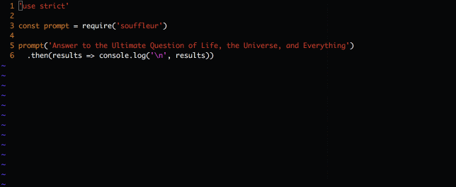

# Souffleur
Simple promise-based command line prompt with retry for empty answers and without external dependencies.

[](https://travis-ci.org/stojanovic/souffleur) [](http://badge.fury.io/js/souffleur)

<h1 align="center">
  
  <br>
</h1>

## Installation

[](https://www.npmjs.com/package/souffleur)

```bash
npm install souffleur
```

## Usage

Souffleur is simple promise based prompt.

If you have just one question pass the question as a string or object to `souffleur` or if you have more questions pass an array.

It'll return an object with each question as a key and each answer as a value.

```
const prompt = require('souffleur')

// For single question
prompt('Any question')
  .then(results => console.log(results))
// Returns {"Any question": "some answer"}
  
// For optional questions
prompt({
  question: 'Optional question',
  optional: true
})
  .then(results => console.log(results))
// Returns {"Optional question": null} if answer is empty

// For default values
prompt({
  question: 'Question',
  default: 42
})
  .then(results => console.log(results))
// Returns {"Question": 42} if answer is empty

// For multiple questions
prompt([
  'Question1',
  {
    question: 'Question 2',
    color: 'green',
    optional: true
  }])
  .then(results => console.log(results))
// Returns {"Question1": "Answer1", "Question 1": "Answer 2"}
```
If you pass an empty answer it'll prompt again with the same question unless you mark that question as an optional.

Simple demo:



## API

### `suffleur(questions, [PromiseImplementation])`

#### - `questions`

Questions can be string, object or an array.

In case of a string, that string will be used as a question and an answer will be required.

If you pass an object following options are allowed:

```js
{
  question: '',   // String, required
  color: 'cyan',  // String, optional, one of the provided colors, default is cyan
  default: '',    // String or a number, optional, the default answer to the question
  optional: false // Boolean, optional, is an answer required, default is true
}
```

Available colors:

- cyan
- blue
- green
- magenta
- red
- yellow

String questions are the same as following object:

```js
{
  question: 'Some question',
  color: 'cyan',
  optional: false
}
```

To pass multiple questions just pass an array of strings and objects.


#### - `PromiseImplementation` (optional)

Pass your promise implementation if you don't want to use the default one, you can use Bluebird and any other A+ Promise library.

#### - `return`

Souffleur always returns an object with questions as keys and answers as values.

If answer was empty, value will be null.

## Running tests

Run all the tests:

```bash
npm run test
```

Run only some tests:

```bash
npm run test -- filter=prefix
```

Get detailed hierarchical test name reporting:

```bash
npm run test -- full
```

## Other

Feather icon by [Mister Pixel from the Noun Project](https://thenounproject.com/MisterPixel/).

## Licence

MIT - see [LICENCE](LICENCE)
